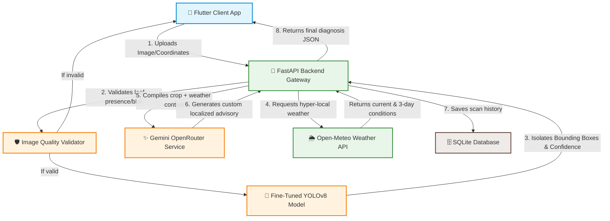

# 🌱 Farmly: AI-Powered Crop Disease Detection & Weather Advisory

[](https://flutter.dev)
[](https://fastapi.tiangolo.com)
[](https://github.com/ultralytics/ultralytics)
[](https://openrouter.ai)
[](#-trilingual-localization-support)

Farmly is a production-grade, state-of-the-art agricultural assistant mobile application tailored for farmers in Maharashtra, India. It leverages a dual-stage AI validation and inference pipeline to diagnose crop diseases, provides hyper-localized weather forecasts with spray window timing advisories, supports trilingual localization, and connects local farming communities together.

---

## 📸 Screen Previews & Key Highlights

*   **⚡ Dual-Engine Scan Pipeline**: Validates image quality in real-time (blur, exposure, crop presence) before passing it to a fine-tuned **YOLOv8** model for local bounding box disease isolation, followed by **Gemini** for dynamic agricultural treatments and advice.
*   **📊 Multi-Image Advanced Scan**: Farmers can capture **3 to 5 photos** of an infected crop from different angles. Farmly runs batched inference, correlates predictions using a weighted average confidence algorithm, and returns highly accurate aggregated results.
*   **☁️ Weather & Smart Spray Advisories**: Deep integration with geographical location fetches live temperature, humidity, wind speed, and precipitation. It uses this context to advise optimal pesticide/fertilizer spraying times and disease risk factors.
*   **🗣️ Trilingual Localized UI**: Complete visual and audio-ready interface localized fully in **Marathi (मराठी)**, **Hindi (हिंदी)**, and **English** for seamless adoption across rural demographics.
*   **👥 Community Hub**: A localized social space for farmers to share scan reports, ask questions, post updates, and collaborate with neighboring agriculturalists.

---

## 🏗️ System Architecture



---

## 🛠️ Technology Stack

### **Frontend (Mobile)**
*   **Framework**: Flutter (Dart SDK `^3.11.3`)
*   **State Management**: `flutter_riverpod` (Riverpod) for high-performance reactive state
*   **Navigation**: `go_router` for declarations-based type-safe deep linking
*   **Animations**: `flutter_animate` for smooth, micro-interactive transitions
*   **Utilities**: `shared_preferences` (persistence), `geolocator` & `geocoding` (GPS telemetry), `http` (API integration)

### **Backend (API & Inference)**
*   **Web Framework**: FastAPI (ASGI python micro-framework) with production CORS middleware
*   **AI/ML Core**:
    *   `ultralytics` (YOLOv8 inference engine)
    *   `openai` (API proxy via OpenRouter for Gemini Pro dynamic advisories)
    *   `Pillow` (Image processing and quality checking)
*   **Database**: SQLAlchemy ORM with SQLite (`farmly.db`) for caching scan logs, community forums, and user management
*   **Networking & Async**: `uvicorn` (ASGI server), `httpx` (asynchronous weather queries), `passlib` & `python-jose` (security)

---

## 🔬 Supported Crop Disease Diagnostics (Rice Focus)

Farmly includes fine-tuned weights detecting the following classes on Rice leaves:

| Disease Class | Marathi Translation (मराठी) | Hindi Translation (हिंदी) | Baseline Severity |
| :--- | :--- | :--- | :--- |
| **Bacterial Leaf Blight** | जिवाणू करपा | जीवाणु झुलसा | 🔴 High |
| **Brown Spot** | तपकिरी ठिपके | भूरा धब्बा | 🟡 Medium |
| **Leaf Blast** | पानावरील करपा | पत्ती का झुलसा | 🛑 Critical |
| **Leaf Scald** | पान पोळणे | पत्ती का जलना | 🟡 Medium |
| **Narrow Brown Leaf Spot** | अरुंद तपकिरी ठिपके | सँकरा भूरा धब्बा | 🟡 Medium |
| **Neck Blast** | मानेचा करपा | गर्दन का झुलसा | 🛑 Critical |
| **Rice Hispa** | भात हिस्पा | धान हिस्पा | 🔴 High |
| **Healthy Leaf** | निरोगी पान | स्वस्थ पत्ती | 🟢 None |

---

## 🚀 Getting Started

### 📂 Backend Setup (FastAPI)

1.  **Navigate into backend directory**:
    ```bash
    cd backend
    ```

2.  **Create and activate a virtual environment**:
    ```bash
    python -m venv venv
    # On Windows:
    .\venv\Scripts\activate
    # On macOS/Linux:
    source venv/bin/activate
    ```

3.  **Install dependencies**:
    ```bash
    pip install -r requirements.txt
    ```

4.  **Configure environment variables**:
    Create a `.env` file in the root of the `backend` directory:
    ```ini
    OPENROUTER_API_KEY=your_openrouter_api_key_here
    DATABASE_URL=sqlite:///./farmly.db
    SECRET_KEY=your_jwt_signing_secret_here
    ```

5.  **Run the ASGI development server**:
    ```bash
    uvicorn main:app --reload --host 0.0.0.0 --port 8000
    ```
    *   **Interactive API documentation**: Visit `http://localhost:8000/docs`
    *   **Health endpoint**: `http://localhost:8000/health`

---

### 📱 Frontend Setup (Flutter)

1.  **Ensure Flutter SDK is installed**:
    ```bash
    flutter --version
    ```

2.  **Get packages**:
    ```bash
    flutter pub get
    ```

3.  **Configure API Base Endpoint**:
    Adjust backend API host URLs in `lib/core/providers.dart` or `lib/services/api_service.dart` to match your local running FastAPI instance IP (e.g., `http://10.0.2.2:8000` for Android Emulator or `http://localhost:8000` for Web).

4.  **Run the Flutter app**:
    ```bash
    flutter run
    ```

---

## 📡 Core API Specification

### **1. Single Scan Analysis**
*   **Endpoint**: `POST /detect/analyze`
*   **Content-Type**: `multipart/form-data`
*   **Parameters**:
    *   `image`: File (JPEG, PNG, WebP)
    *   `language`: String (`"en"` | `"mr"` | `"hi"`)
    *   `location`: String (e.g. `"Pune"`, `"Nashik"`)

### **2. Advanced Multi-Scan Analysis**
*   **Endpoint**: `POST /detect/analyze-multi`
*   **Content-Type**: `multipart/form-data`
*   **Parameters**:
    *   `images`: List of Files (2 to 5 images)
    *   `language`: String
    *   `location`: String

### **3. Weather Advisory**
*   **Endpoint**: `GET /weather/forecast`
*   **Parameters**:
    *   `city`: String
    *   `lat`: Float (Optional)
    *   `lon`: Float (Optional)

---

## 🗣️ Trilingual Localization Support

All app strings are localized dynamic assets mapped across:
*   **English**: Clean, clear scientific advisories.
*   **Marathi (मराठी)**: Specifically customized using terms standard to agrarian environments in Maharashtra (e.g., *जिवाणू करपा*, *फवारणीची वेळ*).
*   **Hindi (हिंदी)**: Broad national dialect compliance ensuring accessible descriptions.

---

## 🛡️ License

This project is licensed under the MIT License - see the LICENSE file for details.

---
🌱 **Farmly** — *Empowering Indian farmers through state-of-the-art AI diagnostics.*
